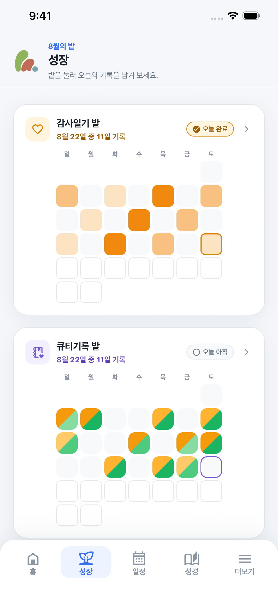
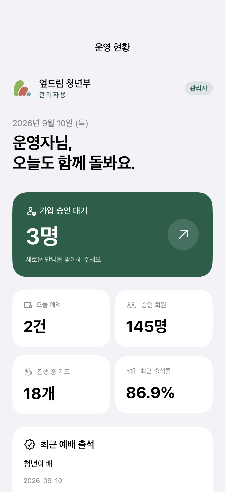
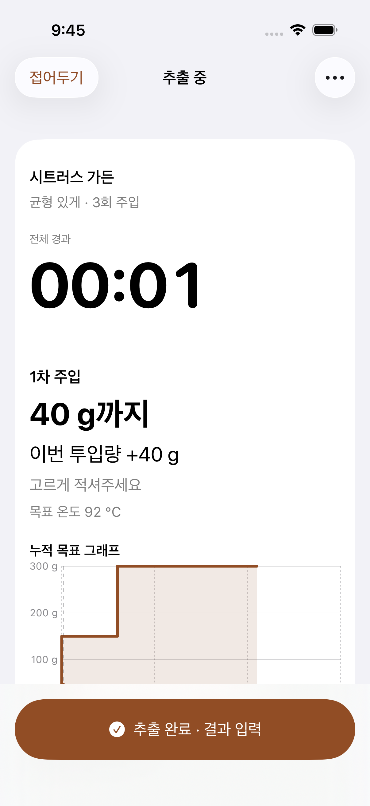
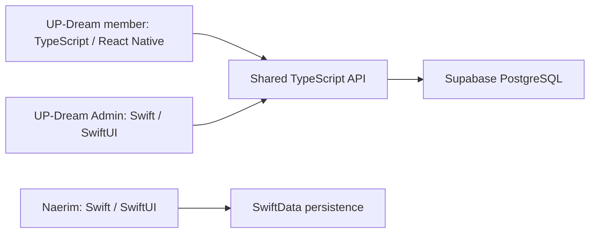

# Yi Suheon · 이수헌

Software developer building and shipping iOS apps and the services behind them.

I independently planned, designed, developed, and released **three App Store apps**: **UP-Dream**, **UP-Dream Admin**, and **Naerim**. My work spans native SwiftUI apps, React Native, shared backend APIs, and persistent data models.

[Portfolio](https://yisuheon.dev) · [App Store](https://apps.apple.com/us/developer/suheon-yi/id6797694037) · [Email](mailto:suheon777@icloud.com)

日本語のプロフィール

iOSアプリと、それを支えるバックエンドを開発しているYi Suheon（이수헌）です。コミュニティ向けの「UP-Dream」と管理者用アプリ、コーヒー記録アプリ「Naerim」の企画・デザイン・開発からApp Storeでの公開まで、一人で手がけました。東京都市大学に1年間交換留学し、日本でエンジニアとして働くことを目指しています。

## Released apps

<table>
<tr>
<th>UP-Dream</th>
<th>UP-Dream Admin</th>
<th>Naerim · 내림</th>
</tr>
<tr>
<td align="center"></td>
<td align="center"></td>
<td align="center"></td>
</tr>
<tr>
<td>Community participation, attendance, and personal reflection.</td>
<td>Membership approvals, attendance, and daily operations.</td>
<td>Record brewing conditions and compare one cup with the next.</td>
</tr>
<tr>
<td>TypeScript · React Native · Expo</td>
<td>Swift · SwiftUI</td>
<td>Swift · SwiftUI · SwiftData</td>
</tr>
<tr>
<td><a href="https://apps.apple.com/kr/app/id6797694035">App Store</a> · <a href="docs/updream.md">Technical overview</a></td>
<td><a href="https://apps.apple.com/kr/app/id6810673532">App Store</a> · <a href="docs/updream.md">Technical overview</a></td>
<td><a href="https://apps.apple.com/kr/app/id6808134502">App Store</a> · <a href="docs/naerim.md">Technical overview</a></td>
</tr>
</table>

Development screenshots use synthetic demo data. [Capture details](assets/screenshots/README.md).
UP-Dream's member and administrator apps form one service. Naerim supports iPhone and iPad, with Korean, English, and Japanese localization.

## Selected implementation

**[Recipe quantity validation in Swift](https://github.com/suheon927/naerim-recipe-validation)** — a standalone example adapted from Naerim. It checks numeric boundaries and scales a pouring plan while preserving the original draft when validation fails.

[Read the code](https://github.com/suheon927/naerim-recipe-validation/tree/main/Sources) · [Read the tests](https://github.com/suheon927/naerim-recipe-validation/tree/main/Tests) · [Run it locally](https://github.com/suheon927/naerim-recipe-validation#run-the-tests)

## Technologies in context

| Language / area | Technologies | Where I used them |
| --- | --- | --- |
| **Swift** | SwiftUI | Native Naerim and UP-Dream Admin apps; Expo native integrations in UP-Dream |
| **Swift persistence & system integration** | Observation, SwiftData, WidgetKit, App Intents | Naerim's records, brewing entry points, and widgets |
| **TypeScript** | React Native, Expo, Expo Router | UP-Dream member app |
| **TypeScript / SQL** | React, vinext/Vite, Supabase PostgreSQL | UP-Dream web administration and shared backend APIs |
| **Deployment & verification** | AWS ECS Fargate, GitHub Actions, XCTest | UP-Dream deployment/check configuration; native app regression tests |
| **Java** | Spring Boot, JPA, MySQL | Stack Snapshot team backend |
| **Python** | Django | Gyeongju hackathon team backend |

**Earlier learning projects:** [Java / Android](https://github.com/suheon927/AndroidStudioProjects), [C](https://github.com/suheon927/MiniGames), and [Python / perceptrons](https://github.com/suheon927/PerceptronPractice).

## Architecture & implementation notes

- **[UP-Dream: member app, admin app, and shared backend](docs/updream.md)** — system boundaries, project layout, authorization, and update delivery.
- **[Naerim: a native brewing workflow](docs/naerim.md)** — value types and persistence, immutable recipe snapshots, and session recovery.

The technical notes connect product problems to implementation decisions, selected source paths, and dated verification results. They distinguish released products from later development work.

## Team projects

### Stack Snapshot · backend contributor

Built the **QR generation and photo-download functionality** for a six-person team's event photo-booth service. The team used Java, Spring Boot, JPA, and MySQL, with Swagger and Nginx in the service stack.

[Repository](https://github.com/mjgwon24/stack-snapshot-back) · [My QR/download implementation](https://github.com/mjgwon24/stack-snapshot-back/commit/88965a2bbc6e419ca10b7fc5641d73bf693046c4)

### Gyeongju Regional Problem-Solving Hackathon · 2024

Backend developer in **Team Null**, which received **2nd place overall**. The tourism experience service combined reservations with photo-layer collection and composition. I worked on the Python/Django backend.

[Repository](https://github.com/Dongguk-Developer/2024hackathon_null) · [Award certificate](https://ibb.co/svXCRMYp)

## Education & international experience

- **Dongguk University WISE** — Computer Engineering.
- **Tokyo City University** — one-year exchange in the Faculty of Information Technology. This experience shaped my goal of working as a software developer in Japan.
- **StackUp, 2nd cohort · 2023** — collaborative learning and programming practice.

[Study archive](https://suheon927.notion.site/11573099573e8045bec2c186c84ba43d?pvs=4) · [Personal portfolio](https://yisuheon.dev)
