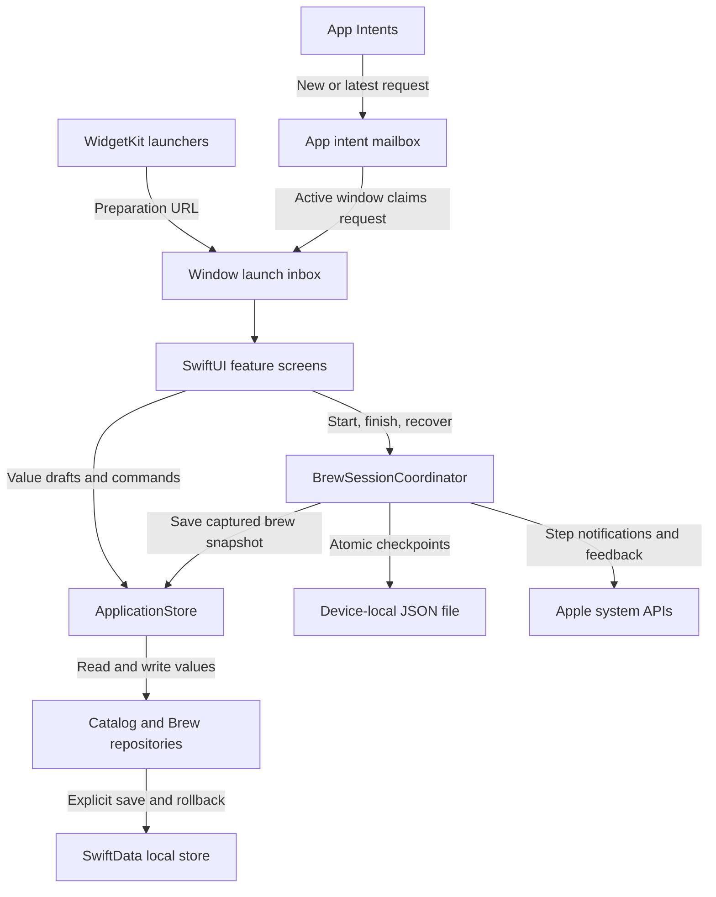

# Naerim — Native Coffee Journal

[← Back to profile](../README.md) · [View on the App Store](https://apps.apple.com/kr/app/id6808134502)

Naerim helps people record coffee brews, keep recipes, and compare the conditions behind each cup.
I independently built and released the app, owning the product and its implementation.
This case study focuses on the data boundaries and recovery behavior behind its native interface.

> Technical snapshot: source reviewed on September 15, 2026.
> The App Store link identifies the released product; reviewed source may include later work.
> Source and test paths below identify implementation areas without linking unpublished source.

## Technology and responsibilities

| Area | Technology | Responsibility |
| --- | --- | --- |
| Language and targets | Swift 6 · iOS 17+ · iPhone and iPad | Native application and device layouts |
| Interface and state | SwiftUI · Observation | Feature screens, observable application state, dependency injection |
| Persistence | SwiftData · versioned schema | Local catalog and brew records behind repositories |
| Recovery | Foundation · ContinuousClock · JSON | Elapsed-time measurement and durable session checkpoints |
| System entry points | WidgetKit · App Intents | Open preparation for a new brew or the latest usable record |
| Localization | String Catalogs | Korean, English, and Japanese app and widget resources |
| Verification | XCTest · UI tests | Domain rules, persistence, recovery, and user flows |

The application uses Apple frameworks throughout these layers.
Additional integrations include TipKit, notifications and feedback, and JSON/CSV export.

## Architecture

Feature screens work with value types through an observable application store.
Repositories contain SwiftData model objects and control when changes become persistent.
A shared session coordinator owns the running or unsaved brew across app windows;
each window keeps its own launch inbox.



The widgets are **launchers**: they open the app's preparation flow.
They do not fetch and display the user's brew database inside the widget extension.
The shared URL contract carries an action, while the app resolves the record and current state.
App Intents also prepare a brew; the user starts timing inside the app.

Relevant paths: `LaunchShared/BrewLaunchAction.swift`,
`Naerim/Infrastructure/Launch/BrewLaunchInbox.swift`,
`Naerim/Infrastructure/Launch/BrewLaunchIntents.swift`, and `NaerimWidgets/NaerimWidgets.swift`.

## Project structure

This is a curated view of the source layout, with responsibilities rather than every file.

```text
Naerim/
├── App/                         # Startup, dependencies, scene lifecycle
├── Domain/
│   ├── Brewing/                 # Brew values, parameters, historical snapshots
│   ├── Recipes/                 # Editable drafts and recipe timelines
│   └── Tags/                    # Stable tag identifiers and localized display
├── Features/
│   ├── BrewPreparation/         # Setup and selective recipe application
│   ├── Brewing/                 # Execution UI and shared session coordinator
│   ├── BrewResult/              # Result editing
│   ├── Collection/              # Beans, equipment, recipes, and photos
│   ├── History/                 # Record browsing, filtering, and corrections
│   ├── Comparison/              # Compare previous brews
│   └── Settings/                # Preferences and export screens
├── Infrastructure/
│   ├── Application/             # Observable value projection and mapping
│   ├── Persistence/             # Repositories, schema, and refresh handling
│   ├── SessionRecovery/         # Durable active and unsaved session files
│   ├── Launch/                  # External launch requests
│   ├── Notifications/           # Step notifications and feedback
│   └── Export/                  # Export snapshots and file generation
├── UI/Components/               # Shared presentation components
└── Resources/                   # String Catalogs and bundled resources
NaerimWidgets/                   # Widget extension
LaunchShared/                    # Shared launch-action contract
NaerimTests/                     # Unit and persistence tests
NaerimUITests/                   # User-flow tests
```

## 1. Keep historical brews independent of editable recipes

**Problem.** Beans, equipment, and recipes change over time. A past brew must retain
the conditions used for that cup when its catalog entries are edited or deleted.

**Decision.** Separate editable value drafts from the snapshots captured for execution.
A brew stores its context and plan independently of mutable catalog relationships.
Recovered sessions can save their captured values even when a referenced master is missing.

**Effect.** Historical comparison can use the conditions recorded for each brew.
Editing a recipe does not redefine a past execution, and deleting a catalog entry does not
require discarding the snapshot already held by an unfinished session.

Implementation: `Naerim/Domain/Recipes/RecipeDraft.swift`,
`Naerim/Domain/Brewing/BrewModels.swift`, and
`Naerim/Infrastructure/Persistence/PersistenceRepository.swift`.
Related tests: `NaerimTests/BetaPersistenceCompatibilityTests.swift` and
`NaerimTests/BrewSessionCoordinatorTests.swift`.

## 2. Recover a brew across termination and failed writes

**Problem.** A timer and unsaved result cannot depend only on visible UI updates or memory.
Database writes and checkpoint cleanup can also fail at different points.

**Decision.** Use `ContinuousClock` for elapsed time in the running process and a persisted
checkpoint for relaunch recovery. Write JSON checkpoints atomically, distinguish corrupt or
unsupported files, and detect backward wall-clock changes during recovery.
Persist the initial checkpoint before activating the session; reconcile saved records by ID
and content so a retry can recognize an already stored result.

**Effect.** Recovery and retry become explicit states. A failed database write can retain the
session for retry; a leftover checkpoint after successful storage can be reconciled.
Conflicting data is surfaced instead of silently replacing a different record.

Implementation: `Naerim/Features/Brewing/PrototypeSession.swift`
(contains `BrewSessionCoordinator`), `Naerim/Infrastructure/SessionRecovery/SessionFileStore.swift`,
and `Naerim/Infrastructure/Persistence/PersistenceRepository.swift`.
Related tests: `NaerimTests/SessionFileStoreTests.swift` and
`NaerimTests/BrewSessionCoordinatorTests.swift`.

## 3. Make persistence an explicit boundary for UI changes

**Problem.** Binding editable screens directly to persistent models makes cancellation,
failed saves, and changes from another window harder to reason about.

**Decision.** Keep SwiftData models inside repositories and return value types to the app.
Repository operations use their own model context, disable autosave, and explicitly save
or roll back. The application store prepares a full replacement projection before exposing
a successful reload to the UI.

**Effect.** Saving has a clear commit point. An unsuccessful reload preserves the previous
usable projection, and editable drafts remain separate from persistent model objects.

Implementation: `Naerim/Infrastructure/Application/ApplicationStore.swift`,
`Naerim/Infrastructure/Application/PersistenceDomainMapper.swift`, and
`Naerim/Infrastructure/Persistence/PersistenceRepository.swift`.
Related tests: `NaerimTests/ApplicationStorePersistenceTests.swift`,
`NaerimTests/PersistenceRepositoryTests.swift`, and `NaerimTests/DataBoundaryRegressionTests.swift`.

## Verification coverage

The reviewed source includes tests for disk reopen compatibility, historical snapshot retention,
checkpoint corruption, write failures, recovery conflicts, and retry behavior.
Export tests cover selected-record scope, opt-in photos, cancellation, and temporary-file cleanup.
Localization tests check bundled resources and stable stored tag IDs; UI tests include English,
Japanese, and large accessibility text scenarios.

Examples: `NaerimTests/BrewExportTests.swift`, `NaerimTests/LocalizationTests.swift`,
and `NaerimUITests/LocalizationFlowTests.swift`.
Verification scope: source-level review of the listed test definitions on 2026-09-15.
