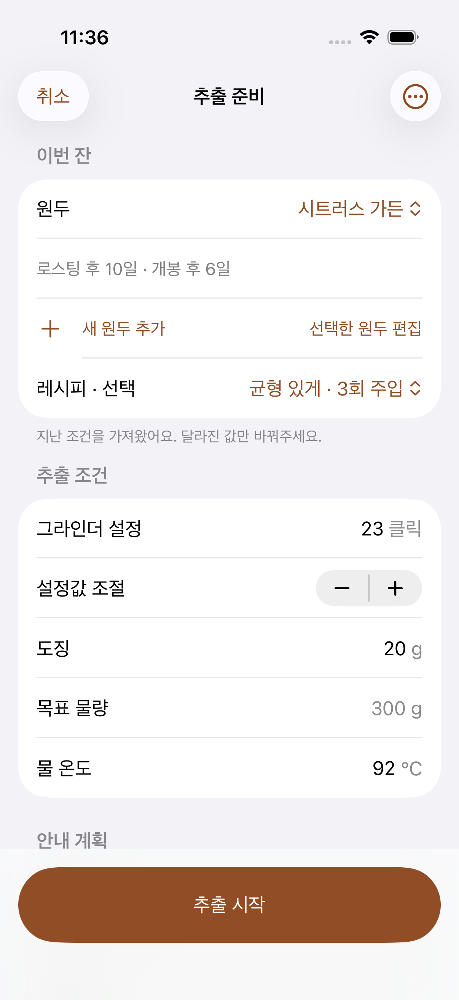
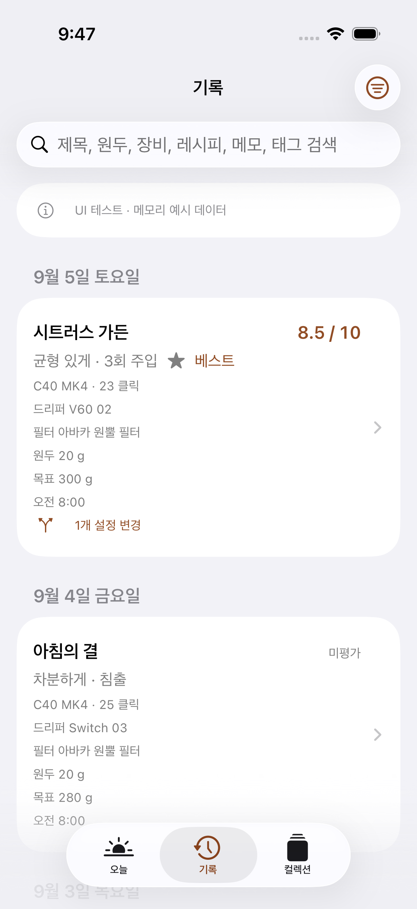
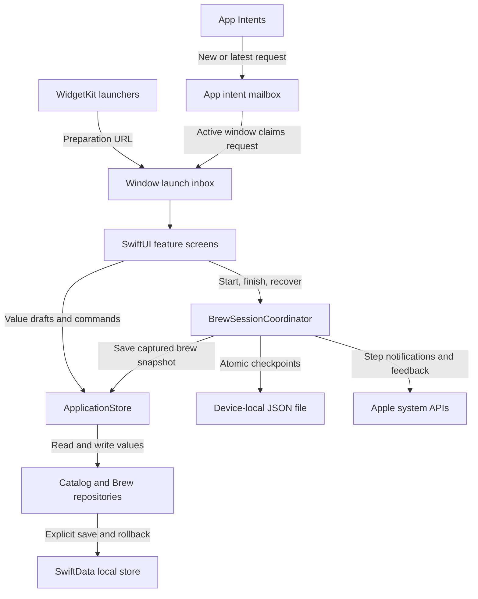

# Naerim — Native Coffee Journal

[← Back to profile](../README.md) · [View on the App Store](https://apps.apple.com/kr/app/id6808134502)

Naerim helps people record coffee brews, keep recipes, and compare the conditions behind each cup.
I independently built and released the app, owning the product and its implementation.
This case study focuses on the data boundaries and recovery behavior behind its native interface.

> Technical snapshot: source and development records reviewed on September 17, 2026.
> The App Store link identifies the released product; reviewed source may include later work.
> Source and test paths below identify implementation areas without linking unpublished source.

[App walkthrough](#app-walkthrough) · [AI-assisted development](#how-i-used-ai) · [Architecture](#architecture) · [Implementation cases](#1-keep-historical-brews-independent-of-editable-recipes) · [Verification](#verification-coverage)

## App walkthrough

Naerim follows a repeatable loop: prepare a cup, follow the pouring plan, and keep the
conditions with the result. These screens connect that workflow to the data decisions below.

<table>
<tr><th>1. Prepare</th><th>2. Brew</th><th>3. Review</th></tr>
<tr>
<td align="center" valign="top"><a href="../assets/screenshots/naerim-preparation.png"></a></td>
<td align="center" valign="top"><a href="../assets/screenshots/naerim-brewing.png"></a></td>
<td align="center" valign="top"><a href="../assets/screenshots/naerim-history.png"></a></td>
</tr>
<tr>
<td>Reuse previous conditions and adjust the variables that changed for this cup.</td>
<td>Follow the current pour target while the session tracks elapsed time and progress.</td>
<td>Find previous brews and inspect the conditions and ratings recorded for each cup.</td>
</tr>
</table>

Simulator captures from September 5–7, 2026, using synthetic test data in development builds.
Click an image for the full-size view. [Capture details](../assets/screenshots/README.md).

### From screen behavior to implementation

| Step | User-facing behavior | Engineering responsibility |
| --- | --- | --- |
| Prepare | Start from previous settings and change individual values | Editable value drafts; optional inputs remain distinct from zero; recipe quantities are validated before replacement |
| Brew | Keep timing and the pouring plan together | A shared session coordinator, monotonic elapsed time, and durable recovery checkpoints |
| Review | Compare the conditions behind past cups | Historical snapshots preserve the recipe and equipment values used at the time |

The [public Swift example](https://github.com/suheon927/naerim-recipe-validation) isolates
the quantity-validation part of preparation. The persistence and recovery cases below
explain what happens after a draft becomes an active brew or a saved record.

## How I used AI

I used **Codex** to assist development in bounded implementation tasks. One recorded example
is the brew-entry refinement: I requested a simpler flow built around individually selected
metrics, and the implementation let users enter measurements step by step during
preparation, repeat brewing, and result entry. The work preserved the distinction between missing values and zero, between
target and actual water amounts, and between a new draft and a previous result.

I define the product behavior, decide which changes to accept, and own release decisions.
Repository instructions give coding agents explicit scope and verification requirements;
builds, XCTest results, UI checks, and source snapshots provide evidence for the resulting changes.
The [recorded verification](#verification-coverage) below identifies what was actually exercised.

AI tools support the development process. Brewing and record comparison use native Swift
data and calculation logic.

Development records: `docs/IMPLEMENTATION_STATUS.md` (September 7 input-flow update),
`docs/DEVELOPMENT.md`.

## Product context: recording the conditions behind a cup

My existing **Coffee Lab** workspace in Notion keeps beans and equipment alongside brew
records: dose, water, temperature, time, tasting notes, and score. It also brings recent
brews and highly rated recipes back into view. That personal workflow provides concrete
context for Naerim's record-and-compare features.

For the app, the key engineering requirement is keeping those comparisons meaningful:
a past brew needs the recipe and equipment values used at the time, even when the catalog
changes later. The snapshot and recovery boundaries below address that requirement.

## Technology and responsibilities

| Area | Technology | Responsibility |
| --- | --- | --- |
| Language and targets | Swift 6 · iOS 17+ · iPhone and iPad | Native application and device layouts |
| Interface and state | SwiftUI · Observation | Feature screens, observable application state, dependency injection |
| Persistence | SwiftData · versioned schema | Local catalog and brew records behind repositories |
| Recovery | Foundation · ContinuousClock · JSON | Elapsed-time measurement and durable session checkpoints |
| System entry points | WidgetKit · App Intents | Open preparation for a new brew or the latest usable record |
| Localization | String Catalogs | Korean, English, and Japanese app and widget resources |
| Verification | XCTest · UI tests | Domain rules, persistence, recovery, and user flows |

The application uses Apple frameworks throughout these layers.
Additional integrations include TipKit, notifications and feedback, and JSON/CSV export.

## Architecture

Feature screens work with value types through an observable application store.
Repositories contain SwiftData model objects and control when changes become persistent.
A shared session coordinator owns the running or unsaved brew across app windows;
each window keeps its own launch inbox.



The widgets are **launchers**: they open the app's preparation flow.
They do not fetch and display the user's brew database inside the widget extension.
The shared URL contract carries an action, while the app resolves the record and current state.
App Intents also prepare a brew; the user starts timing inside the app.

Relevant paths: `LaunchShared/BrewLaunchAction.swift`,
`Naerim/Infrastructure/Launch/BrewLaunchInbox.swift`,
`Naerim/Infrastructure/Launch/BrewLaunchIntents.swift`, and `NaerimWidgets/NaerimWidgets.swift`.

## Project structure

This is a curated view of the source layout, with responsibilities rather than every file.

```text
Naerim/
├── App/                         # Startup, dependencies, scene lifecycle
├── Domain/
│   ├── Brewing/                 # Brew values, parameters, historical snapshots
│   ├── Recipes/                 # Editable drafts and recipe timelines
│   └── Tags/                    # Stable tag identifiers and localized display
├── Features/
│   ├── BrewPreparation/         # Setup and selective recipe application
│   ├── Brewing/                 # Execution UI and shared session coordinator
│   ├── BrewResult/              # Result editing
│   ├── Collection/              # Beans, equipment, recipes, and photos
│   ├── History/                 # Record browsing, filtering, and corrections
│   ├── Comparison/              # Compare previous brews
│   └── Settings/                # Preferences and export screens
├── Infrastructure/
│   ├── Application/             # Observable value projection and mapping
│   ├── Persistence/             # Repositories, schema, and refresh handling
│   ├── SessionRecovery/         # Durable active and unsaved session files
│   ├── Launch/                  # External launch requests
│   ├── Notifications/           # Step notifications and feedback
│   └── Export/                  # Export snapshots and file generation
├── UI/Components/               # Shared presentation components
└── Resources/                   # String Catalogs and bundled resources
NaerimWidgets/                   # Widget extension
LaunchShared/                    # Shared launch-action contract
NaerimTests/                     # Unit and persistence tests
NaerimUITests/                   # User-flow tests
```

## 1. Keep historical brews independent of editable recipes

**Problem.** Beans, equipment, and recipes change over time. A past brew must retain
the conditions used for that cup when its catalog entries are edited or deleted.

**Decision.** Separate editable value drafts from the snapshots captured for execution.
A brew stores its context and plan independently of mutable catalog relationships.
Recovered sessions can save their captured values even when a referenced master is missing.

**Effect.** Historical comparison can use the conditions recorded for each brew.
Editing a recipe does not redefine a past execution, and deleting a catalog entry does not
require discarding the snapshot already held by an unfinished session.

**Trade-off.** Capturing values duplicates some catalog data and requires snapshot-format
compatibility. In return, a historical record does not depend on the current state of a
mutable recipe or equipment entry.

Implementation: `Naerim/Domain/Recipes/RecipeDraft.swift`,
`Naerim/Domain/Brewing/BrewModels.swift`, and
`Naerim/Infrastructure/Persistence/PersistenceRepository.swift`.
Related tests: `NaerimTests/BetaPersistenceCompatibilityTests.swift` and
`NaerimTests/BrewSessionCoordinatorTests.swift`.

## 2. Recover a brew across termination and failed writes

**Problem.** A timer and unsaved result cannot depend only on visible UI updates or memory.
Database writes and checkpoint cleanup can also fail at different points.

**Decision.** Use `ContinuousClock` for elapsed time in the running process and a persisted
checkpoint for relaunch recovery. Write JSON checkpoints atomically, distinguish corrupt or
unsupported files, and detect backward wall-clock changes during recovery.
Persist the initial checkpoint before activating the session; reconcile saved records by ID
and content so a retry can recognize an already stored result.

**Effect.** Recovery and retry become explicit states. A failed database write can retain the
session for retry; a leftover checkpoint after successful storage can be reconciled.
Conflicting data is surfaced instead of silently replacing a different record.

**Trade-off.** Durable checkpoints add file I/O and recovery states alongside the database.
Saving the result and removing its checkpoint are separate operations, so retries need
explicit reconciliation when one succeeds and the other fails.

Implementation: `Naerim/Features/Brewing/PrototypeSession.swift`
(contains `BrewSessionCoordinator`), `Naerim/Infrastructure/SessionRecovery/SessionFileStore.swift`,
and `Naerim/Infrastructure/Persistence/PersistenceRepository.swift`.
Related tests: `NaerimTests/SessionFileStoreTests.swift` and
`NaerimTests/BrewSessionCoordinatorTests.swift`.

## 3. Make persistence an explicit boundary for UI changes

**Problem.** Binding editable screens directly to persistent models makes cancellation,
failed saves, and changes from another window harder to reason about.

**Decision.** Keep SwiftData models inside repositories and return value types to the app.
Repository operations use their own model context, disable autosave, and explicitly save
or roll back. The application store prepares a full replacement projection before exposing
a successful reload to the UI.

**Effect.** Saving has a clear commit point. An unsuccessful reload preserves the previous
usable projection, and editable drafts remain separate from persistent model objects.

Implementation: `Naerim/Infrastructure/Application/ApplicationStore.swift`,
`Naerim/Infrastructure/Application/PersistenceDomainMapper.swift`, and
`Naerim/Infrastructure/Persistence/PersistenceRepository.swift`.
Related tests: `NaerimTests/ApplicationStorePersistenceTests.swift`,
`NaerimTests/PersistenceRepositoryTests.swift`, and `NaerimTests/DataBoundaryRegressionTests.swift`.

## 4. Reject invalid quantities without losing the recipe draft

**Reproduced failure.** The September 10 release QA record documents a crash at numeric
boundaries: summed step durations could overflow, and very large floating-point values
could fail during conversion to integers.

**Change.** Use explicit overflow checks and exact integer conversion. Water scaling builds
a replacement draft only after every amount validates, preserving the original draft if
an adjustment fails.

**Recorded result.** All **7 quantity-boundary tests** passed in the result bundle below.
They cover overflow, non-finite values, rounding residuals, and failed adjustments.
These tests are part of the reported total.

Implementation: `Naerim/Domain/Recipes/RecipeModels.swift` and
`Naerim/Domain/Recipes/RecipeDraft.swift`.
Tests: `NaerimTests/RecipeDraftQuantityTests.swift`.

**Public implementation:** [standalone Swift package](https://github.com/suheon927/naerim-recipe-validation)
with focused tests and documented simplifications. It extracts this quantity-validation
case so the implementation can be inspected without the full application.
Release record: `docs/RELEASE_QA_2026-09-10.md`.

## Verification coverage

The reviewed source includes tests for disk reopen compatibility, historical snapshot retention,
checkpoint corruption, write failures, recovery conflicts, and retry behavior.
Export tests cover selected-record scope, opt-in photos, cancellation, and temporary-file cleanup.
Localization tests check bundled resources and stable stored tag IDs; UI tests include English,
Japanese, and large accessibility text scenarios.

Examples: `NaerimTests/BrewExportTests.swift`, `NaerimTests/LocalizationTests.swift`,
and `NaerimUITests/LocalizationFlowTests.swift`.
### Recorded execution inspected · 2026-09-17

The Xcode result bundle from **2026-09-10** was inspected directly with `xcresulttool`:

| Environment | Result |
| --- | --- |
| iPhone 17 Pro simulator · iOS 26.5 | **300 passed; 1 skipped; 0 failed** |
| Breakdown of passed tests in this bundle | **297 unit tests + 3 UI tests** |

The bundle includes **24 session-coordinator tests and 9 session-file tests**, all passed.
They exercise recovery, failed writes, and retry behavior described above; these are subsets
of the 300 passed tests, not additional runs.

The run's source manifest contains 126 app and test files. Their SHA-256 hashes still
match the current checkout at `d91e3e7`, connecting the recorded result to the reviewed source.

This is a recorded execution, not a new run on September 17. The release verification
record also tracks UI scenarios across other runs; those counts are not added here.
The skipped test explicitly initializes a development CloudKit schema and requires an
opt-in signed iCloud test host. This run is not evidence of live cross-device sync.

Evidence paths in the application repository:
`local-artifacts/one-cup-experiment/results/final-validation.xcresult` and
`local-artifacts/one-cup-experiment/verification.json`.
