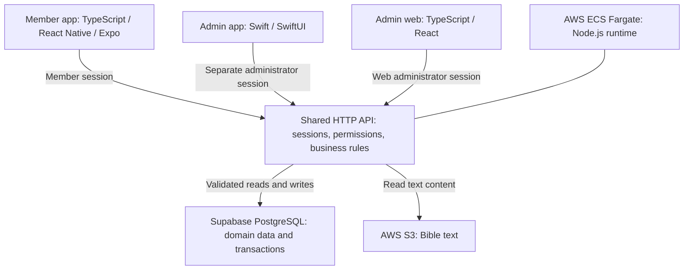

# UP-Dream · Community apps & shared backend

[Profile](../README.md) · [Member app](https://apps.apple.com/kr/app/id6797694035) · [Administrator app](https://apps.apple.com/kr/app/id6810673532)

I independently planned, designed, developed, and released the member and administrator apps for a church community. The service brings together membership approval, attendance, announcements, schedules, and room reservations. A web administration interface and both mobile clients share the backend.

**Technical snapshot:** source reviewed on 2026-09-15. These notes describe the implementation in the repository; individual App Store builds may contain an earlier subset of it.

## Stack and responsibilities

| Layer | Technologies | Responsibility |
| --- | --- | --- |
| Member app | TypeScript, React Native, Expo, Expo Router | Member-facing navigation, workflows, sessions, and screen data |
| iOS integrations | Swift, Expo native modules | Kakao sign-in, home widgets, and other platform integrations |
| Administrator app | Swift, SwiftUI, URLSession, Keychain | Native iPhone/iPad operations, isolated administrator sessions, API requests |
| Web & API | TypeScript, React, Node.js, vinext/Vite | Web administration and Next.js App Router-compatible route handlers |
| Data | SQL, Supabase PostgreSQL | Domain records, constraints, migrations, and transactions |
| Deployment configuration | AWS ECS Fargate, ALB, ECR | Containerized server runtime and delivery |
| Bible content | AWS S3 | Reading Bible text through the server's storage adapter |
| Change notifications | Supabase Broadcast, HTTP revision polling | Notify clients of changes and trigger an authorized refetch |

## System structure



The diagram shows the domain request path. The member app also receives change signals through Supabase Broadcast, with HTTP revision polling as a fallback. Those signals trigger a new request to the permission-checked API; they do not carry the underlying domain records.

## Project layout

Selected paths from the application repository:

```text
UP-Dream/
├── mobile/
│   ├── app/                  Expo Router entry points
│   ├── src/features/         Feature screens and domain behavior
│   ├── src/context/          Authentication and app-wide state
│   ├── src/lib/              HTTP, secure sessions, screen cache
│   ├── src/realtime/         Change signals and refetch coordination
│   └── modules/              Swift-based Expo native integrations
├── admin-ios/
│   ├── UPDreamAdmin/
│   │   ├── App/              App entry point and adaptive navigation
│   │   ├── Core/             API client, authentication, Keychain
│   │   └── Features/         Membership, attendance, and operations
│   └── UPDreamAdminTests/     XCTest regression tests
├── app/
│   ├── admin/                Web administration
│   └── api/                  Shared routes and server authorization
├── shared/                   TypeScript domain rules
├── db/                       Database interface and PostgreSQL adapter
├── supabase/migrations/      Schema, constraints, and access policies
├── runtime/aws/              Runtime and storage adapters
├── infra/aws/                Deployment configuration
└── tests/                    API, concurrency, and mobile regressions
```

## Engineering decisions

### 1. One domain API with distinct client sessions

**Problem:** the member app, administrator app, and web interface act on the same records, but their authority differs. A role change must also invalidate work already in flight.

**Implementation:** shared request-context code resolves session type, approval status, access tier, and capabilities on the server. The native administrator app keeps its session in Keychain and uses an ephemeral URLSession with cookie/cache reuse disabled. Requests capture a session generation so that a response belonging to an earlier session can be rejected.

**Why it matters:** authorization has a server-side decision point, and an old request cannot restore a previous session's screen state after its authority changes.

Source anchors: `app/api/_request-context.ts`, `admin-ios/UPDreamAdmin/Core/APIClient.swift`, `admin-ios/UPDreamAdmin/Core/KeychainStore.swift`.

### 2. Attendance edits as a transaction with conflict detection

**Problem:** two leaders may edit the same attendance record, while membership or the editor's authority changes during a save. Partial writes would leave attendance, revisions, and audit history inconsistent.

**Implementation:** writes use an expected version to detect conflicting edits. After acquiring the relevant workflow lock, the server rechecks the actor and target. Attendance changes, revision updates, and audit history are committed in one transaction.

**Why it matters:** concurrent edits have an explicit conflict outcome, and a failure in the combined write can roll back the whole operation.

Source anchor: `app/api/attendance/_atomic-write.ts`.

### 3. Responsive screen data with explicit invalidation

**Problem:** refetching on every navigation duplicates work, but retaining data indefinitely can preserve records from an old membership scope or role.

**Implementation:** the member app retains the last successful result while revalidating, deduplicates in-flight requests, and tracks request sequence/generation. Scope changes discard cached values and invalidate delayed responses. Realtime messages carry change signals, and actual records are fetched again through the API.

**Why it matters:** ordinary refresh failures can preserve useful screen state, while an authorization-boundary change follows a stricter discard path.

Source anchors: `mobile/src/lib/screenDataCache.ts`, `mobile/src/realtime/contract.ts`, `mobile/src/realtime/hybridConnection.ts`.

## Verification in the repository

| Behavior covered | Test or workflow |
| --- | --- |
| Concurrent attendance updates and transaction rollback | `tests/attendance-concurrency-api.test.mjs` |
| Authority changes during PostgreSQL lock contention | `tests/admin-native-write-authority-postgres.test.ts` |
| Request deduplication, failed refreshes, and stale responses after scope changes | `tests/mobile-screen-data-cache.test.ts` |
| Native session isolation, unauthorized responses, retry rules, and delayed response invalidation | `admin-ios/UPDreamAdminTests/APIClientTests.swift` |
| Web/mobile type checks, lint, tests, migration checks, dependency audit, and PostgreSQL integration checks | `.github/workflows/verify.yml` |

Verification scope: source-level review of the listed test definitions and workflow configuration on 2026-09-15.

## Public product links

- [UP-Dream member app](https://apps.apple.com/kr/app/id6797694035)
- [UP-Dream administrator app](https://apps.apple.com/kr/app/id6810673532)
- [Service website](https://updream.church)

[Back to profile](../README.md)
