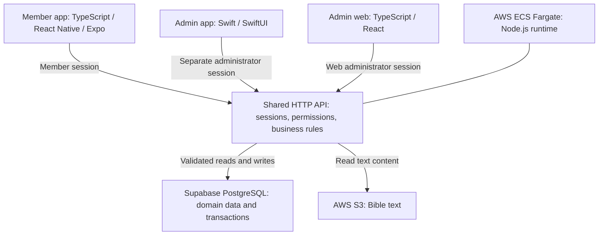

# UP-Dream · Community apps & shared backend

[Profile](../README.md) · [Member app](https://apps.apple.com/kr/app/id6797694035) · [Administrator app](https://apps.apple.com/kr/app/id6810673532)

I independently planned, designed, developed, and released the member and administrator apps for a church community. The service brings together membership approval, attendance, announcements, schedules, and room reservations. A web administration interface and both mobile clients share the backend.

**Technical snapshot:** source, development records, and selected tests reviewed on 2026-09-17. These notes describe the implementation in the repository; individual App Store builds may contain an earlier subset of it.

## Stack and responsibilities

| Layer | Technologies | Responsibility |
| --- | --- | --- |
| Member app | TypeScript, React Native, Expo, Expo Router | Member-facing navigation, workflows, sessions, and screen data |
| iOS integrations | Swift, Expo native modules | Kakao sign-in, home widgets, and other platform integrations |
| Administrator app | Swift, SwiftUI, URLSession, Keychain | Native iPhone/iPad operations, isolated administrator sessions, API requests |
| Web & API | TypeScript, React, Node.js, vinext/Vite | Web administration and Next.js App Router-compatible route handlers |
| Data | SQL, Supabase PostgreSQL | Domain records, constraints, migrations, and transactions |
| Deployment configuration | AWS ECS Fargate, ALB, ECR | Containerized server runtime and delivery |
| Bible content | AWS S3 | Reading Bible text through the server's storage adapter |
| Change notifications | Supabase Broadcast, HTTP revision polling | Notify clients of changes and trigger an authorized refetch |

## System structure



The diagram shows the domain request path. The member app also receives change signals through Supabase Broadcast, with HTTP revision polling as a fallback. Those signals trigger a new request to the permission-checked API; they do not carry the underlying domain records.

## Project layout

Selected paths from the application repository:

```text
UP-Dream/
├── mobile/
│   ├── app/                  Expo Router entry points
│   ├── src/features/         Feature screens and domain behavior
│   ├── src/context/          Authentication and app-wide state
│   ├── src/lib/              HTTP, secure sessions, screen cache
│   ├── src/realtime/         Change signals and refetch coordination
│   └── modules/              Swift-based Expo native integrations
├── admin-ios/
│   ├── UPDreamAdmin/
│   │   ├── App/              App entry point and adaptive navigation
│   │   ├── Core/             API client, authentication, Keychain
│   │   └── Features/         Membership, attendance, and operations
│   └── UPDreamAdminTests/     XCTest regression tests
├── app/
│   ├── admin/                Web administration
│   └── api/                  Shared routes and server authorization
├── shared/                   TypeScript domain rules
├── db/                       Database interface and PostgreSQL adapter
├── supabase/migrations/      Schema, constraints, and access policies
├── runtime/aws/              Runtime and storage adapters
├── infra/aws/                Deployment configuration
└── tests/                    API, concurrency, and mobile regressions
```

## Engineering decisions

The product context comes from my Notion beta-feedback log and development records.
August 2026 feedback described loading screens, repeated sign-in after approval, and difficulty
finding attendance controls. September 2026 administrator-app requirements called for familiar
web workflows and role-appropriate actions on iPhone and iPad. The cases below show how the
current source handles related workflow and reliability concerns.


### 1. Admin app: keep sessions and permitted actions consistent

**Problem:** administrators need familiar operational workflows on mobile, but not every role may perform the same actions. The member app, administrator app, and web interface share records; a role change must also invalidate work already in flight.

**Implementation:** shared request-context code resolves session type, approval status, access tier, and capabilities on the server. The native app uses server-provided capabilities to select its available workflows. It keeps its session in Keychain and uses an ephemeral URLSession with cookie/cache reuse disabled. Requests capture a session generation so that a response belonging to an earlier session can be rejected.

**Why it matters:** authorization has a server-side decision point, and an old request cannot restore a previous session's screen state after its authority changes.

Source anchors: `app/api/_request-context.ts`, `admin-ios/UPDreamAdmin/App/AdminShell.swift`, `admin-ios/UPDreamAdmin/Core/APIClient.swift`, `admin-ios/UPDreamAdmin/Core/KeychainStore.swift`.

**Operational example — development work dated September 15:** attendance analysis keeps
unmarked records separate from absences and requires sufficient observation history before
classifying a change. Weekly summaries preserve that distinction. The selected native
checks below execute 7 attendance tests and 15 work-item policy/state tests, including
scope changes and conflicting edits.

Source/test anchors: `admin-ios/UPDreamAdminTests/AttendanceExpansionTests.swift`,
`admin-ios/UPDreamAdminTests/AdminWorkPolicyTests.swift`.


### 2. Shared API: save attendance with conflict detection

**Problem:** two leaders may edit the same attendance record, while membership or the editor's authority changes during a save. Partial writes would leave attendance, revisions, and audit history inconsistent.

**Implementation:** writes use an expected version to detect conflicting edits. After acquiring the relevant workflow lock, the server rechecks the actor and target. Attendance changes, revision updates, and audit history are committed in one transaction.

**Why it matters:** concurrent edits have an explicit conflict outcome, and a failure in the combined write can roll back the whole operation.

Source anchor: `app/api/attendance/_atomic-write.ts`.

### 3. Member app: recover sessions and refresh screen data safely

**Problem:** a temporary connection failure during startup should not force a user to sign in again. During navigation, repeated requests add work, while retaining data indefinitely can preserve records from an old membership scope or role.

**Implementation:** session restoration distinguishes temporary failures from invalid credentials and provides a retry path. The member app retains the last successful screen result while revalidating, deduplicates in-flight requests, and tracks request sequence/generation. Scope changes discard cached values and invalidate delayed responses. Realtime messages carry change signals, and actual records are fetched again through the API.

**Why it matters:** users can retry a temporary startup failure, and ordinary refresh failures can preserve useful screen state. An authorization-boundary change follows a stricter discard path.

Source anchors: `mobile/src/lib/sessionBootstrap.ts`, `mobile/src/context/AuthContext.tsx`, `mobile/src/lib/screenDataCache.ts`, `mobile/src/realtime/contract.ts`, `mobile/src/realtime/hybridConnection.ts`.

### 4. Member app: fix a crash during Android's first layout

**Reproduction:** the September 13 hotfix record describes a startup crash in which the
bookshelf's initial measured width was zero, producing zero-sized text. Setting the view's
opacity to zero did not prevent Android Fabric from measuring its text.

**Change:** wait for a usable measured width before mounting the labels and enforce a
minimum font size. Regression tests check unmeasured, invalid, and narrow layouts.
The bookshelf test file was rerun as part of the 49 passing Jest tests below.

Source/test anchors: `mobile/src/components/bible/BibleBookshelf.tsx`,
`mobile/tests/bible-bookshelf.test.tsx`.
Release record: `docs/guides/RELEASE_1_3_1_ANDROID_HOTFIX_2026_09_13.md`.
The recorded Android submission was to a **closed Alpha track**.

## Verification in the repository

| Behavior covered | Test or workflow |
| --- | --- |
| Concurrent attendance updates and transaction rollback | `tests/attendance-concurrency-api.test.mjs` |
| Authority changes during PostgreSQL lock contention | `tests/admin-native-write-authority-postgres.test.ts` |
| Request deduplication, failed refreshes, and stale responses after scope changes | `tests/mobile-screen-data-cache.test.ts` |
| Native session isolation, unauthorized responses, retry rules, and delayed response invalidation | `admin-ios/UPDreamAdminTests/APIClientTests.swift` |
| Web/mobile type checks, lint, tests, migration checks, dependency audit, and PostgreSQL integration checks | `.github/workflows/verify.yml` |

### Executed checks · 2026-09-17

Selected tests were run locally against the development working tree based on
`681cf196` **with uncommitted changes**, using Node.js 22.23.2 and the installed dependencies.
The runs cleared inherited environment variables and set explicit test settings; API, storage, and socket interactions
in the selected client tests were mocked.

| Run | Scope | Observed result |
| --- | --- | --- |
| Node.js tests · 4 files | Screen cache, realtime client, secure session restoration, administrator work-item validation | **59 passed; 0 failed; 0 skipped** |
| Jest · 2 files | Login recovery and Bible bookshelf component regressions | **49 passed; 0 failed; 0 skipped** |
| Native policy runners · 2 files | Compile and execute Swift/XCTest attendance and work-item policies | **7 attendance + 15 work-item tests passed; both runners passed** |

Login-recovery regressions exercise temporary failures, repeated retry actions,
invalid sessions, logout, and replacement-login races. Native policy checks cover
attendance editing and administrator work-item behavior without requiring a server.

These are separate runs, not a combined project-wide test count. They do not exercise
live services, a complete native app in a simulator, or physical-device behavior.
The PostgreSQL integration tests, native `APIClientTests`, and full CI workflow listed
above were reviewed as source, not rerun in this check.

<details>
<summary>Selected test commands</summary>

```sh
env -i PATH=/opt/homebrew/bin:/usr/bin:/bin TZ=Asia/Seoul NODE_ENV=test \
node --import tsx --test --test-reporter=tap \
  tests/mobile-screen-data-cache.test.ts \
  tests/realtime-v2-client.test.ts \
  tests/mobile-auth-secure-restore.test.ts \
  tests/admin-work-items.test.ts

env -i PATH=/opt/homebrew/bin:/usr/bin:/bin TZ=Asia/Seoul NODE_ENV=test \
  BABEL_ENV=test EXPO_NO_DOTENV=1 EXPO_NO_CLIENT_ENV_VARS=1 \
node node_modules/jest/bin/jest.js \
  --config mobile/jest.config.cjs --runInBand --watchman=false \
  --runTestsByPath mobile/tests/auth-session-recovery.test.tsx \
  mobile/tests/bible-bookshelf.test.tsx

env -i PATH=/opt/homebrew/bin:/usr/bin:/bin TZ=Asia/Seoul NODE_ENV=test \
node --test --test-reporter=tap \
  tests/admin-native-work-policy.test.mjs \
  tests/admin-native-attendance-expansion.test.mjs
```

</details>

## Public product links

- [UP-Dream member app](https://apps.apple.com/kr/app/id6797694035)
- [UP-Dream administrator app](https://apps.apple.com/kr/app/id6810673532)
- [Service website](https://updream.church)

[Back to profile](../README.md)
